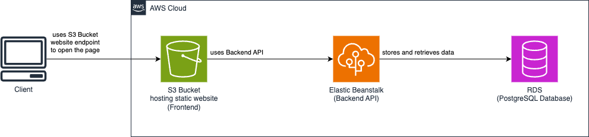

# Infrastructure

Infrastructure contains 3 main components:

- S3 bucket with enabled static website hosting responsible for hosting the Frontend.
- Elastic Beanstalk application responsible for serving Backend API. This API is used by Frontend.
- RDS running Postgresql database. It is used by Backend API to store and retrieve data.

Whole infrastructure is represented on the diagram below:

